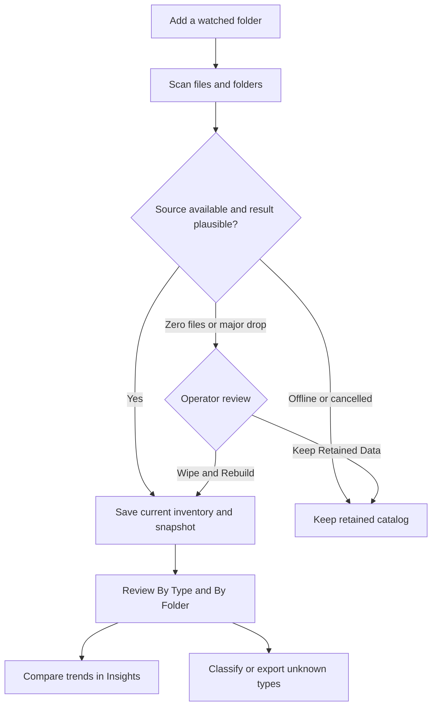

# Find File Type — Workflow Guide

This guide summarizes the normal operator workflow. The canonical control and
settings reference is the [User Guide](UserGuide.md).

## Catalog and review

1. Add a folder such as `/Volumes/Example_NAS/Example_Project/2026`.
2. Let the scan finish or cancel it from the bottom status banner.
3. Use **By Type** to understand formats and **By Folder** to locate storage
   concentrations.
4. Use **Insights** for historical comparisons. The picker displays both the
   folder name and location alias; hover it for the complete path.
5. Use **Uncategorized** to classify unknown extensions or export evidence for
   review. CSV and clipboard output include counts, sizes, and up to three
   representative paths.

## When storage is missing or incomplete

An unavailable source does not erase its saved data. A zero-file or major-drop
scan also remains non-destructive until you explicitly approve replacement.

- Choose **Keep Retained Data** when a volume may be offline, partially mounted,
  or still synchronizing.
- Choose **Wipe and Rebuild from This Scan** only after confirming the watched
  path and its contents are complete.
- **Rebuild Current Data** preflights every watched folder before deleting any
  scan-derived records. One failed or suspicious source cancels the whole
  rebuild and preserves the existing catalog.
- Removing a watched folder in the app is different: after confirmation, it
  stops watching that source and deletes its saved scan history.

## Classify and contribute

1. Sort Uncategorized by file count or total size.
2. Inspect the representative paths for workflow context.
3. Classify known extensions with Group, Category, Stage, and Role.
4. Ignore generated junk that should not affect completion.
5. Export only your added classifications from the contribution controls when
   you want to propose defaults upstream.

Uncategorized evidence exports may contain complete storage paths. Review them
before sharing externally.

## Updates

Use **Check for Updates…** from the app menu. Draft GitHub releases are never
visible to the updater. Stable releases are followed by default; prereleases
require a build configured to include them.
